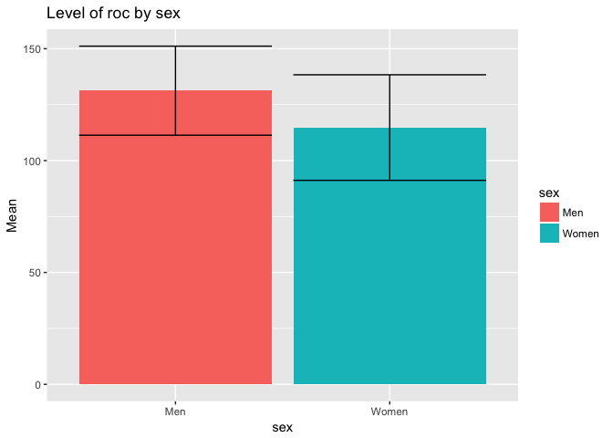
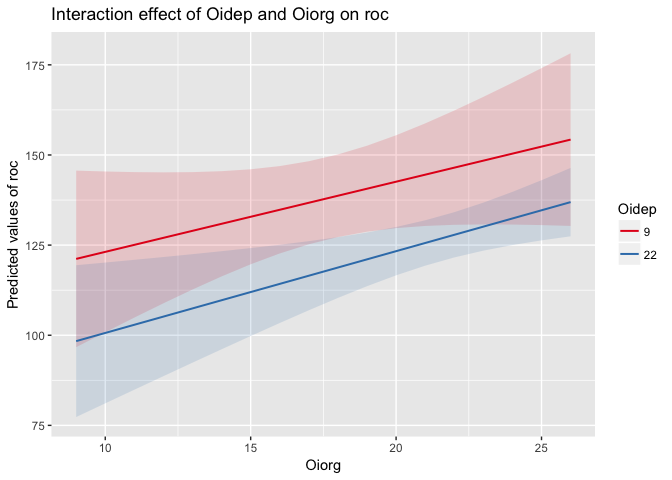
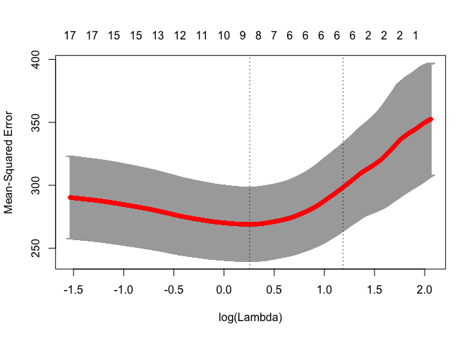

Описание результатов
================
Alexey Klimov
30 мая, 2017

-   Графики
-   [Линейное моделирование](#-)
    -   [Сравнимаем полученные модели](#--)
-   [Регрессия с регуляризацией](#--)
-   График
-   [Коэффициенты модели (только те, которые не равны нулю)](#-------)

Исходный код доступен в файле по ссылке: [README.Rmd](README.Rmd), скачать его можно с [репозитория на гитхабе](https://github.com/rhangelxs/r_socio_hse).

Графики
-------

<!--html_preserve-->

<!--/html_preserve-->

Линейное моделирование
----------------------

Сначала построим две модели:

1.  Модель для двух предикторов (lm0)
2.  Модель для двух предикторов с интеракцией между ними (lm1)

Показатели последней модели (lm1) с интеракцией:

    Call:
    lm(formula = roc ~ Oidep * Oiorg, data = data)

    Residuals:
       Min     1Q Median     3Q    Max 
    -51.73 -15.57   1.28  15.31  41.26 

    Coefficients:
                Estimate Std. Error t value Pr(>|t|)  
    (Intercept) 121.4591    47.6636    2.55    0.012 *
    Oidep        -1.9775     2.8275   -0.70    0.485  
    Oiorg         1.7235     2.5140    0.69    0.494  
    Oidep:Oiorg   0.0248     0.1428    0.17    0.863  
    ---
    Signif. codes:  0 '***' 0.001 '**' 0.01 '*' 0.05 '.' 0.1 ' ' 1

    Residual standard error: 20 on 161 degrees of freedom
    Multiple R-squared:  0.122, Adjusted R-squared:  0.106 
    F-statistic: 7.45 on 3 and 161 DF,  p-value: 0.000106

Из вывода линейной модели нужно привести: **R*2, *N*, *p* − *v**a**l**u**e*, F-статистику*

Для каждого регрессора (предиктора): Как минимум *β* − *к**о**э**ф**ф**и**ц**и**е**н**т**а* и значимость + крайне желательно *t*-значние, либо *S**E*

### Сравнимаем полученные модели

Сравним наши модели с помощью метода (stepwise regression[1]) модель с интеракцией и модель без интеракции.

Для этого нам поможет пакет `lmSupport`, но в целом можно ориентироваться на AIC и BIC. Но в нашем случае достаточно воспользоваться ANOVA (или diff-test).

    SSE (Compact) =  62585 
    SSE (Augmented) =  62573 
    Delta R-Squared =  0.00016 
    Partial Eta-Squared (PRE) =  0.00019 
    F(1,161) = 0.03, p = 0.86

В результате добавление инетеракции (аддитивный эффект) улучшает предсказательные способности модели (*Δ**R*2) на 0.016%. Добавление интеракции значимо не улучшает показатели соответсвия модели данным (*p* = 0.86)

Нагляднее всего график:

Регрессия с регуляризацией
--------------------------

В некоторых случаях в ручную отбирать регрессоры неудобно. Для этого можно использовать PLS (аля SEM), Ridge или Lasso.

Полезным будет техника разбиения выборки на обучающую и тестовую (80/20) из Machine Learning.

Для простоты предположим, что у нас нет никаких априорных представлений о модели. Попробуем найти самую удачную модель из всего датасета (включая исключительно числовые или факторные переменные).

В качестве интересующей нас (выходной) перменной мы зададим:

    [1] "roc"

Основаня проблема пакета `glmnet` в том, что ему на вход нужно подавать разреженные матрицы. Напишим для этого небольшую вспомогательную функцию (может даже не одну).

    Warning: attributes are not identical across measure variables; they will
    be dropped

В качестве предикторов числовых и категориальных предикторов у нас было 19 предиктор(а/ов): *comp*, *sex*, *age*, *tenure*, *promo*, *satis*, *position*, *norms1*, *norms2*, *Oidep*, *Oiorg*, *StK*, *StI*, *StRA*, *StRE*, *Pemo*, *Ptime*, *Femo* and *Ftime*.

1.  Сразу следует удалить предикторы, предсказательная сила которых слишком высокая (например, в этот список могут попасть компоненты выходной переменной). Мы же не хотим проверять очевидные вещи :)

2.  Затем следует вручную удалить предикторы, которые попали по ошибке (например, в этот список могут попасть компоненты выходной переменной). Внимательно посмотрим на вывод этой команды:

<table style="width:25%;">
<colgroup>
<col width="18%" />
<col width="6%" />
</colgroup>
<thead>
<tr class="header">
<th align="center">variable.y</th>
<th align="center">cor</th>
</tr>
</thead>
<tbody>
<tr class="odd">
<td align="center">Femo</td>
<td align="center">0.42</td>
</tr>
<tr class="even">
<td align="center">StRE</td>
<td align="center">0.33</td>
</tr>
<tr class="odd">
<td align="center">Ftime</td>
<td align="center">0.32</td>
</tr>
<tr class="even">
<td align="center">norms1</td>
<td align="center">0.31</td>
</tr>
<tr class="odd">
<td align="center">norms2</td>
<td align="center">0.30</td>
</tr>
</tbody>
</table>

1.  Чтобы не столкнуться с проблемами мулитиколлинеарности или некорректного кодирования переменных, посмотрим на все предикторы, коэффциент корреляций которых между собой больше 0.9:

-   **variable.x**:

<!-- end of list -->
.

В *итоговый список* предикторов для LASSO регрессии у нас попали 19 переменных: *comp*, *sex*, *age*, *tenure*, *promo*, *satis*, *position*, *norms1*, *norms2*, *Oidep*, *Oiorg*, *StK*, *StI*, *StRA*, *StRE*, *Pemo*, *Ptime*, *Femo* and *Ftime*

По умолчанию `glmnet` строит LASSO модель (`alpha` = 1), если нужна Ridged регрессию, то нужно указать параметр `alpha` = 0.

Выбираем лучшую лямбду

<table style="width:36%;">
<colgroup>
<col width="18%" />
<col width="18%" />
</colgroup>
<thead>
<tr class="header">
<th align="center">lambda.min</th>
<th align="center">lambda.1se</th>
</tr>
</thead>
<tbody>
<tr class="odd">
<td align="center">1.292</td>
<td align="center">3.276</td>
</tr>
</tbody>
</table>

    [1] 3.3

График
------

Коэффициенты модели (только те, которые не равны нулю)
------------------------------------------------------

<table style="width:69%;">
<colgroup>
<col width="16%" />
<col width="9%" />
<col width="15%" />
<col width="12%" />
<col width="15%" />
</colgroup>
<thead>
<tr class="header">
<th align="center">term</th>
<th align="center">step</th>
<th align="center">estimate</th>
<th align="center">lambda</th>
<th align="center">dev.ratio</th>
</tr>
</thead>
<tbody>
<tr class="odd">
<td align="center">(Intercept)</td>
<td align="center">1</td>
<td align="center">115.5</td>
<td align="center">3.276</td>
<td align="center">0.2342</td>
</tr>
<tr class="even">
<td align="center">satis</td>
<td align="center">1</td>
<td align="center">0.3289</td>
<td align="center">3.276</td>
<td align="center">0.2342</td>
</tr>
<tr class="odd">
<td align="center">norms2</td>
<td align="center">1</td>
<td align="center">2.449</td>
<td align="center">3.276</td>
<td align="center">0.2342</td>
</tr>
<tr class="even">
<td align="center">Oiorg</td>
<td align="center">1</td>
<td align="center">0.1468</td>
<td align="center">3.276</td>
<td align="center">0.2342</td>
</tr>
<tr class="odd">
<td align="center">StRA</td>
<td align="center">1</td>
<td align="center">-0.1222</td>
<td align="center">3.276</td>
<td align="center">0.2342</td>
</tr>
<tr class="even">
<td align="center">StRE</td>
<td align="center">1</td>
<td align="center">0.06668</td>
<td align="center">3.276</td>
<td align="center">0.2342</td>
</tr>
<tr class="odd">
<td align="center">Femo</td>
<td align="center">1</td>
<td align="center">1.753</td>
<td align="center">3.276</td>
<td align="center">0.2342</td>
</tr>
</tbody>
</table>

[1] почему этот старый и добрый метод не современный написано тут: <https://stats.stackexchange.com/questions/13686/what-are-modern-easily-used-alternatives-to-stepwise-regression>
